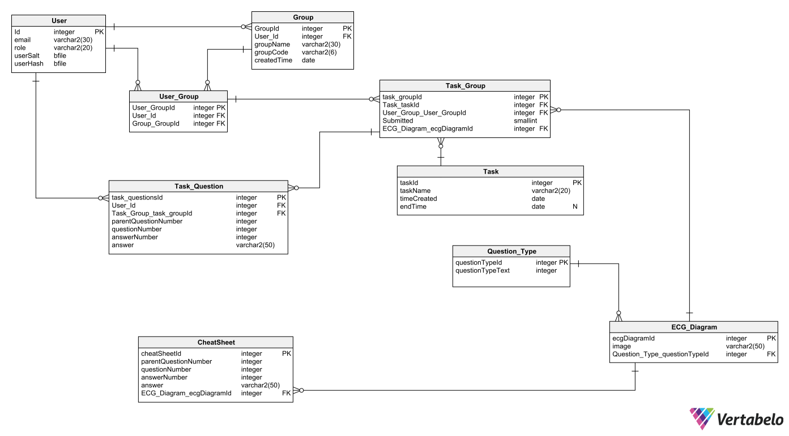

# ECG_pro_project

## Remember to create a branch when you start working

## Avoiding conflicts

To avoid conflicts when merging you should make sure everything is commited.
It is better to make more small merges than to make one big merge.

Remember to pull main everytime you want to merge main into your branch and vice cersa

Usually you will want to do something like this to merge main into your branch:

```
git checkout main
git pull
git checkout <your-branch-name>
git merge main
```

By merging main to your branch first makes it easier to merge your changes to main and keeps conflicts out of main.

## First time cloning
For frontend:
```
cd frontend
npm install
npm run dev
```
For backend:

If you're using visual studio just make sure you open PROJECT not FOLDER.

If you're using vscode, make sure you have c# extension installed.

Then:
```
cd backend
f5
```
You should be prompted by vscode to add missing assets. Just click yes to install them.

Alternatively, press ctrl+shift+p to bring up a search bar at the top center, type ".NET Generate Assets for build and debug" and press enter.

When they're installed, press f5 again and it should run.

## Libraries used for the frontend which you might want to read how they work
For handling api requests [React query](https://react-query.tanstack.com/)

For design, e.g Button, Table [Material UI](https://mui.com/)

For localization [i18next](https://www.i18next.com/)

## Entity Diagram
[Link](https://my.vertabelo.com/doc/jjtXAf2kuhDclH1Qxk8GZps7VW0GMJED)

